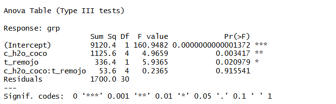
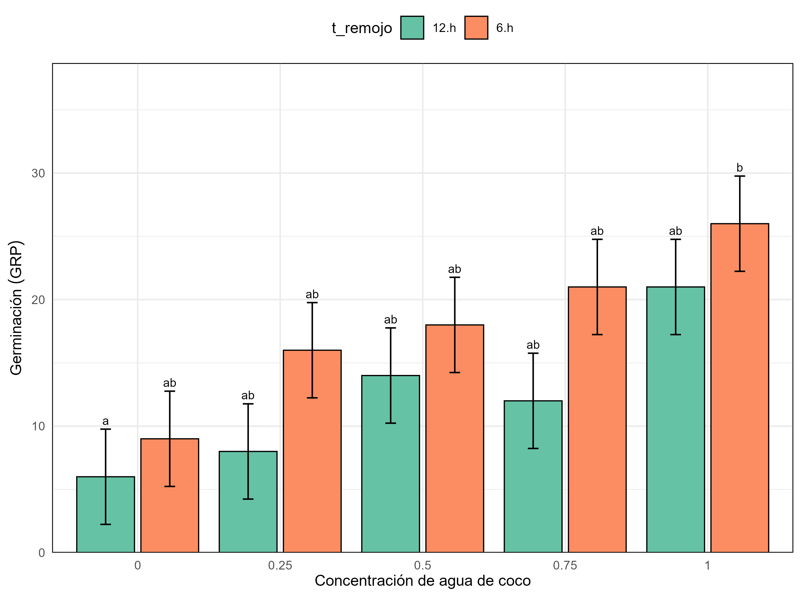
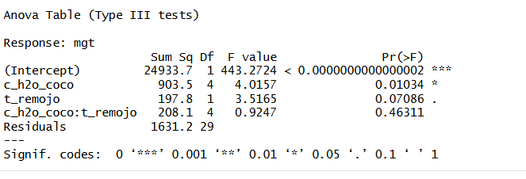
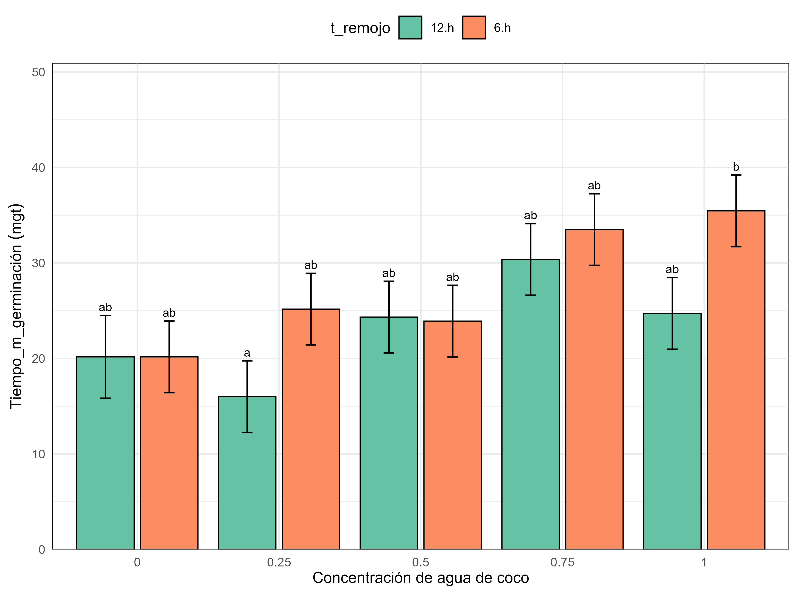
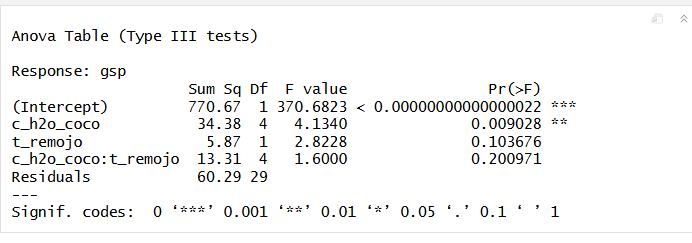
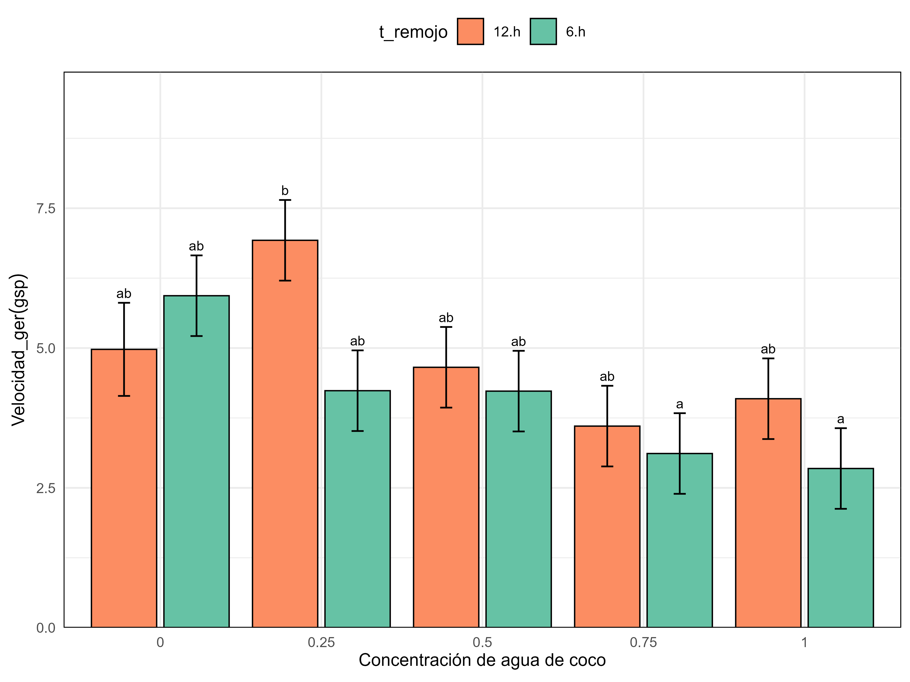
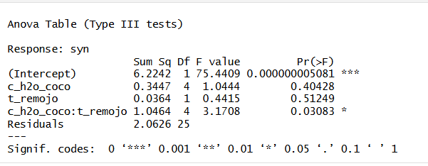
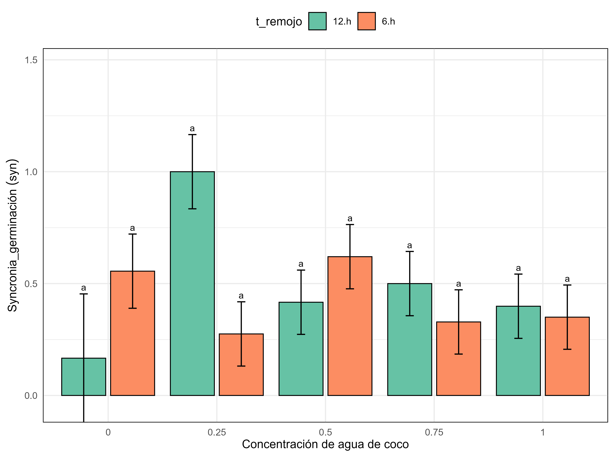
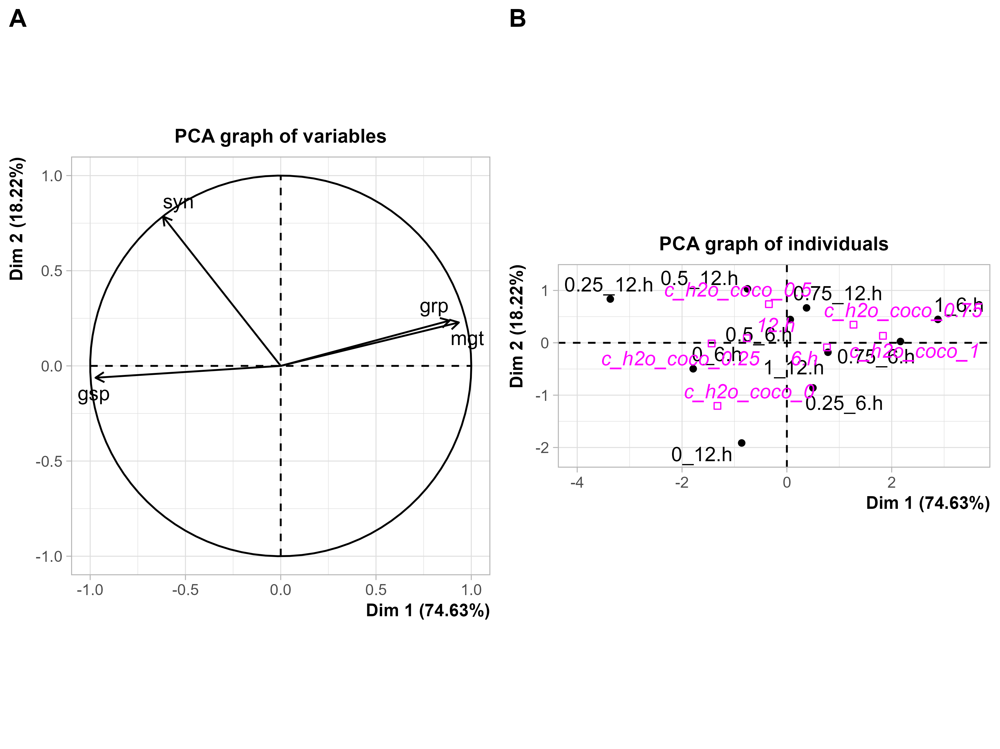
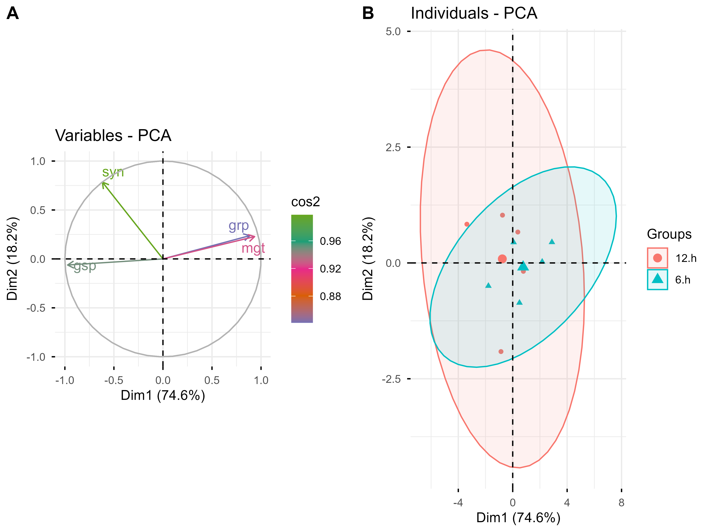

# Objetivo 1

Determinar el efecto del tiempo de remojo (8 y 12 h) y la concentración de agua de coco (100 %, 75 %, 50 %, 25 % y 0 %) sobre el porcentaje de germinación (GRP), el tiempo medio de germinación (MGT), la velocidad de germinación (GSP) y la sincronía de germinación (GSY) de semillas de tarwi.

## Porcentaje de germinación (grp)

**Gráfico de porcentaje de germinación**

**Figura 1**. Efecto de la interacción entre la concentración de agua de coco y el tiempo de remojo sobre la germinación (GRP) de semillas de tarwi.

En términos generales, se observa que la germinación aumentó conforme se incrementó la concentración de agua de coco, independientemente del tiempo de remojo. Los tratamientos con agua de coco al 100 **%** presentaron los mayores valores de germinación, alcanzando aproximadamente **26 %** con 6 horas de remojo y 21 % con 12 horas de remojo.

Asimismo, para todas las concentraciones evaluadas, el remojo durante 6 horas produjo mayores porcentajes de germinación que el remojo durante 12 horas, lo que sugiere que un tiempo de exposición prolongado puede disminuir parcialmente el efecto estimulante del agua de coco sobre el proceso germinativo.

## TTiempo medio de germinacion (mgt)

**Grafico de Tiempo medio de germinación (mgt)**

# **Velocidad de germinacion (germination speed)**

## Gráfico de Valocidad de germinación

# Syncronia de la Germinación (syn)

## Grafico de sincronia de la germinación

# Objetivo 2

## PCA

Identificar, mediante un análisis de componentes principales (PCA), las relaciones multivariadas entre GRP, MGT, GSP y GSY, y agrupar los tratamientos (individuos) según su similitud de respuesta germinativa, con el fin de determinar el tratamiento con el mejor desempeño global.

